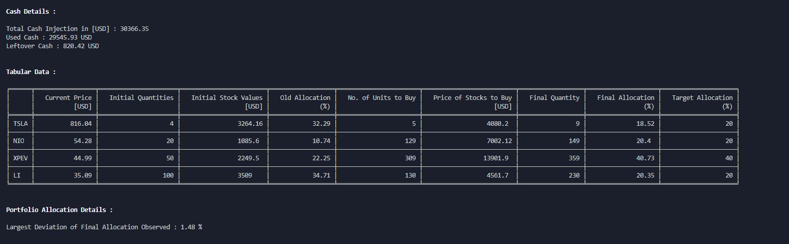

# Portfolio Balancer

[](http://ansicolortags.readthedocs.io/?badge=latest) [](https://www.python.org/)      [](https://code.visualstudio.com/)


A simple algorithm that helps you split your assets quickly into their pre - specified allocations 


***Rebalancing Portfolio has never been so easy***


## Installation
<br>

- Download Repository

        git clone https://github.com/maze508/portfolio_rebalancer.git

- Navigate to correct directory

        cd port_balancer

- Install Relevant Packages

        pip install -r requirements.txt


## How to Use
<br>

Open the `env.py` file and define the following fields

    total_cash         - Total Cash Injection
    cash_currency      - Currency type of Cash Injection
    current_port       - Current Portfolio Composition (Tickers + Quantity)
    target_asset_alloc - Target Asset Allocation (%) (Tickers + Desired % Allocation)

    [Optional] selling_allowed - Allow or Disallow Algorithm to sell owned assets

Run `main.py` 


## Demo

Below is a possible portfolio composition

```python
# Details of Cash Injection [dict : (Keys --> amount of cash injection) (Values --> currency of cash injection)]
cash_total = {
    30000: 'usd',
    500: 'sgd'
}

# Current Portfolio Composition [dict : (Keys --> tickers) (Values --> Quantity of stock)]
current_port = {
    "TSLA": 4,
    "NIO": 20,
    "XPEV": 50,
    "LI": 100
}


# Target Asset Allocation (%) [dict : (Keys --> ticker) (Values --> % Allocation)]
target_asset_alloc = {
    "TSLA": 20,
    "NIO": 20,
    "XPEV": 40,
    "LI": 20
}

# Flag to allow or disallow selling [(Bool) : `True OR False`]
selling_allowed = False

# Flag to allow or disallow selling [(Bool) : `True OR False`]
selling_allowed = False
```

After running `main.py` the resulting terminal display / output should be close to the following




<sub>*Results as of 8<sup>th</sup> Jan 2021*</sub>

## Road Map

- [ ] More Flexible Currency Conversion 
- [ ] Increase Calculating Speed (Optimisation)
- [x] Detailed Documentation

## References

> Images
>> its_easy.png - http://www.andyhanselman.com/2016/07/08/improving-your-customer-experience-with-technology-its-easy/
